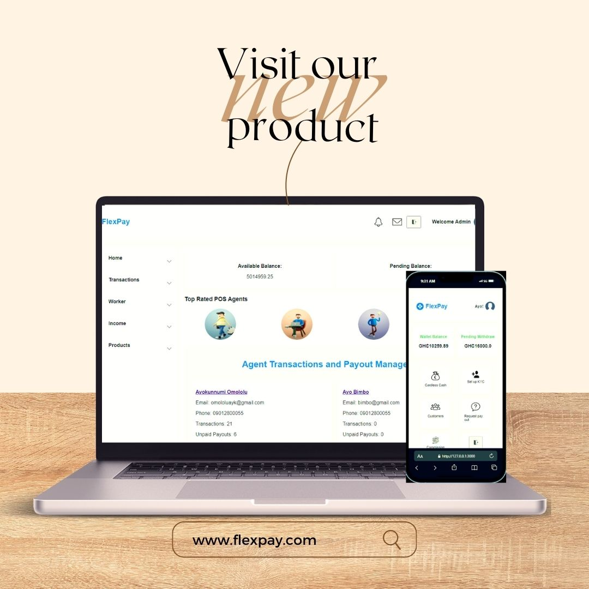

<a name="readme-top"></a>

<div align="center">
  <!-- You are encouraged to replace this logo with your own! Otherwise you can also remove it. -->
  
  <br/>

  <h3><b>Kora Flex Pay</b></h3>

</div>

<!-- TABLE OF CONTENTS -->

# 📗 Table of Contents

- [📖 About the Project](#about-project)
  - [🛠 Built With](#built-with)
    - [Tech Stack](#tech-stack)
    - [Key Features](#key-features)
  - [🚀 Live Demo](#live-demo)
- [💻 Getting Started](#getting-started)
  - [Prerequisites](#prerequisites)
  - [Setup](#setup)
  - [Install](#install)
  - [Usage](#usage)
- [👥 Authors](#authors)
- [🔭 Future Features](#future-features)
- [🤝 Contributing](#contributing)
- [⭐️ Show your support](#support)
- [🙏 Acknowledgements](#acknowledgements)
- [❓ FAQ (OPTIONAL)](#faq)
- [📝 License](#license)

<!-- PROJECT DESCRIPTION -->

# 📖 Kora Flex Pay <a name="about-project"></a>

**Kora flex pay** is a fintech application that enables users to perform secure cardless transactions, including cash withdrawals and funds transfers, without the need for a physical card. With a focus on user-friendly design, the platform provides an intuitive alternative to traditional card transactions at POS terminals, ensuring both convenience and robust protection for users’ accounts.

## 🛠 Built With <a name="built-with"></a>

### Tech Stack <a name="tech-stack"></a>

<details>
  <summary>Client & Server</summary>
  <ul>
    <li><a href="https://rubyonrails.org/">Rails</a></li>
  </ul>
</details>

<details>
<summary>Database</summary>
  <ul>
    <li><a href="https://www.postgresql.org/">PostgreSQL</a></li>
  </ul>
</details>

<!-- Features -->

### Key Features <a name="key-features"></a>

- **POS Agents Sign up/onboarding**
- **Log in**
- **Homepage**
- **Dashboard**
- **Withdraw Funds**
- **Transactions**
- **Customers**
- **Earnings**
- **Log out**

<p align="right">(<a href="#readme-top">back to top</a>)</p>

<!-- LIVE DEMO -->

## 🚀 Live Demo <a name="live-demo"></a>

- [Live Demo Link](https://google.com)

<p align="right">(<a href="#readme-top">back to top</a>)</p>

<!-- GETTING STARTED -->

## 💻 Getting Started <a name="getting-started"></a>

To get a local copy up and running, follow these steps.

### Prerequisites

In order to run this project you need:

```sh
 gem install rails
```

### Setup

Clone this repository to your desired folder:

```sh
  cd my-folder
  git clone git@github.com:Ayokunnumi1/Kora-flex-pay.git
```

### Install

Install this project with:

```sh
  cd Kora-flex-pay
  bundle install
```

### Usage

To run the project, execute the following command:

```sh
  rails server
```

<p align="right">(<a href="#readme-top">back to top</a>)</p>

<!-- AUTHORS -->

## 👥 Authors <a name="authors"></a>

👤 **Author1**

- GitHub: [Al Amin Khan Shakil](https://github.com/Al-Amin-Khan-Shakil)
- Twitter: [Al Amin Khan Shakil](https://https://twitter.com/AlAminKhan85004)
- LinkedIn: [Al Amin Khan Shakil](https://https://www.linkedin.com/in/al-amin-khan-shakil/)

👤 **Ayokunnumi**

- GitHub: [Ayokunnumi](https://github.com/Ayokunnumi1)
- Twitter: [Ayokunnumi](https://twitter.com/AyokunnumiA)
- LinkedIn: [Ayokunnumi](https://www.linkedin.com/in/ayokunnumiomololu)

<p align="right">(<a href="#readme-top">back to top</a>)</p>

<!-- FUTURE FEATURES -->

## 🔭 Future Features <a name="future-features"></a>

- **KYC Set up**
- **Direct bank transfer**
- **ATM installation set up**

<p align="right">(<a href="#readme-top">back to top</a>)</p>

<!-- CONTRIBUTING -->

## 🤝 Contributing <a name="contributing"></a>

Contributions, issues, and feature requests are welcome!

Feel free to check the [issues page](https://github.com/Ayokunnumi1/Kora-flex-pay/issues).

<p align="right">(<a href="#readme-top">back to top</a>)</p>

<!-- SUPPORT -->

## ⭐️ Show your support <a name="support"></a>

If you like this project please give it a star.

<p align="right">(<a href="#readme-top">back to top</a>)</p>

<!-- ACKNOWLEDGEMENTS -->

## 🙏 Acknowledgments <a name="acknowledgements"></a>

I would like to thank my friend Yousuf and Ayokunnumi for there support.

<p align="right">(<a href="#readme-top">back to top</a>)</p>

<!-- FAQ (optional) -->

## ❓ FAQ (OPTIONAL) <a name="faq"></a>

- **Can I contribute to this project?**

  - Yes, you can. You can fork you modification on this project. If it gets approval then we will merge your changes.

- **What knowledge Should I have to create a project like this?**

  - You should have basic RubyONRails Knowledge.

<p align="right">(<a href="#readme-top">back to top</a>)</p>

<!-- LICENSE -->

## 📝 License <a name="license"></a>

This project is [MIT](./LICENSE) licensed.

<p align="right">(<a href="#readme-top">back to top</a>)</p>
